# htsglang — GPU Topologies, feature by feature

Companion to [FEATURES_VS_UPSTREAM.md](FEATURES_VS_UPSTREAM.md). That document is the
capability inventory; this one is the *placement and memory* guide.

For **each fork feature** there is **one side-by-side VRAM/RAM diagram**:

- **Left — the fork on the reference rig** (1× RTX 5090 32 GB + 2× RTX 3080 20 GB, PCIe, no
  NVLink, no P2P), drawn granularly per card into its measured memory segments (weight shard,
  KV cache, GDN/Mamba state, MoE experts, draft pools, CUDA graphs, CUDA context, free/reserve),
  plus a host-RAM bar.
- **Right — the hypothetical *homogeneous* upstream config** for the same workload: **N identical
  cards, symmetric TP = card count**, with the divisibility reason that config lands where it does. The
  entire right panel is illustrative.

The honest difference each diagram shows is a **capacity / hardware-premise** one — *use the
mismatched cards you already own (fork) vs. buy and run N identical cards (upstream)* — **not** a
"faster" claim. Where throughput is relevant it is stated plainly, with the interconnect caveat
(this rig has no P2P and no NVLink, so every cross-GPU collective is PCIe-bandwidth-bound).

## How to read the diagrams

**GPU boxes are drawn with height scaled to VRAM**; a separate horizontal bar is **pinned host
RAM (DDR)**. Colour meaning is consistent across every diagram:

- blue — model-weight shard; green — KV cache (on-GPU); amber — resident MoE experts; light amber —
  expert scratch / prefetch; red — experts spilled to host RAM; teal — host-staged / spilled KV;
  grey-blue — free / reserve; grey — CUDA context + overhead.
- steel — full-attention layer (holds KV); violet — GDN / linear-attention layer; light violet —
  GDN recurrent state; pink — MTP / NEXTN draft head or draft pool; pale red-grey — a region an
  upstream symmetric-TP layout does not admit here.

### Evidence convention (used in every diagram)

Every segment is drawn according to how well it is grounded, and this is spelled out in each
diagram's evidence key:

- **MEASURED** — **solid fill**. A number read from a boot log or registry dump.
- **ESTIMATED** — **solid fill + diagonal hatch + dashed outline**. Derived from geometry, cell
  size, or a named assumption. **The entire upstream (right) panel is ESTIMATED by construction** —
  it is hypothetical hardware that was never built here.
- **UNKNOWN / not captured** — an **empty box with a dashed grey outline**, labelled *not captured*.
  A segment that genuinely was not dumped; it is **never** back-filled with a guess.

Throughput figures from before 2026-07-22 came from a bench that is now known to be
content-contaminated; they are **withdrawn, not presented as fact**, and are flagged where they
would otherwise appear.

---

# The features, side by side

## 1 — Asymmetric DCP = the KV / token axis

*Asymmetric decode context parallelism (asymmetric DCP) — a capacity-weighted KV token split across the
ranks; the KV/token axis, decoupled from the weight split of §2.*

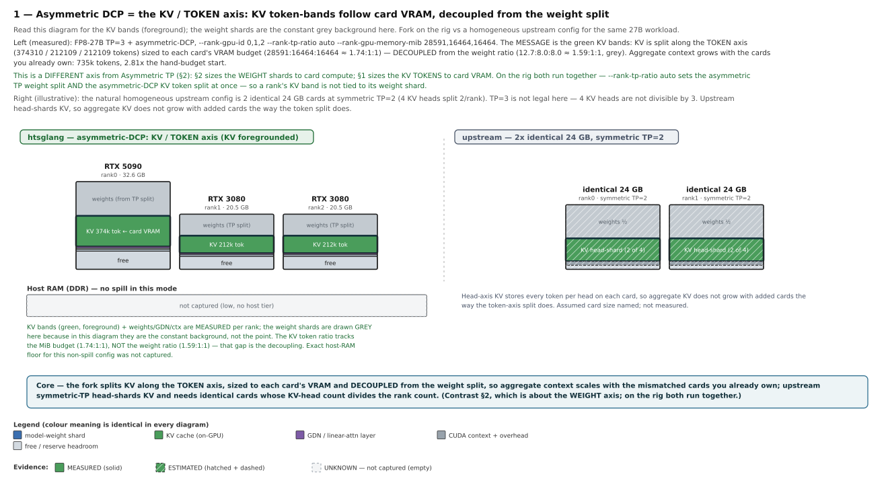

**Read this diagram for the KV bands (green, foreground); the weight shards are the constant grey
background here.** On the rig (measured), the KV cache is split along the **token axis** across three
mismatched cards — 374310 / 212109 / 212109 tokens — **sized to each card's VRAM budget**
(28591 : 16464 : 16464 ≈ **1.74 : 1 : 1**), which is **decoupled from the weight ratio**
(12.7 : 8.0 : 8.0 ≈ **1.59 : 1 : 1**). That gap is the whole point: a rank's KV band follows its VRAM,
not its weight shard, so **aggregate context scales with the cards you already own** (measured 735k
tokens, 2.81× the hand-budget start). The upstream-natural config is 2 identical 24 GB cards at symmetric
TP=2: with **4 KV heads**, TP=3 is not legal (4 is not divisible by 3); upstream head-shards KV, so it
does not grow aggregate token capacity as cards are added. The exact host-RAM floor for this non-spill
config was not captured.

**Do not confuse §1 with §2.** §1 (here) is the **KV / token axis**; §2 is the **weight axis**. On the
rig they **run together** — `--rank-tp-ratio auto` sets the asymmetric-TP weight split *and* the asymmetric-DCP
KV token split at once — which is exactly why a rank's KV band is not tied to its weight shard.

## 2 — Asymmetric TP = the weight axis

*Asymmetric tensor parallelism (asymmetric TP) — sizing the weight shards for heterogeneous / mismatched
GPUs (cf. HexGen, Hetis).*

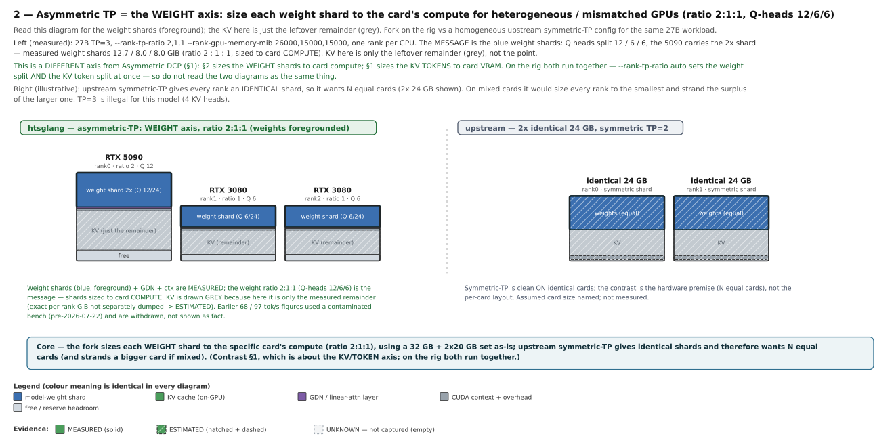

**Read this diagram for the weight shards (blue, foreground); the KV here is only the leftover
remainder (grey).** `--rank-tp-ratio 2,1,1` sizes each **weight shard** to its card's **compute** —
**Q heads split 12 / 6 / 6**, the 5090 carries the **2× shard** (measured shards 12.7 / 8.0 / 8.0 GiB,
ratio **2 : 1 : 1**). KV on this diagram is just the measured remainder, not the message. Upstream
symmetric-TP gives every rank an **identical** shard, so it wants **N equal cards**; on mixed cards it would
size every rank to the smallest and strand the surplus of the larger one. The earlier 68 / 97 tok/s
decode figures used a contaminated bench and are withdrawn.

**Do not confuse §2 with §1.** §2 (here) is the **weight axis** (shard size follows card compute); §1
is the **KV / token axis** (KV tokens follow card VRAM, decoupled from the weights). On the rig both
run together via `--rank-tp-ratio auto`, so the two diagrams describe **different axes of the same
run**, not the same thing.

## 3 — Cross-algorithm drafter routing (NEXTN ↔ DFLASH)

*The CLI/env surface for this feature is named **cross-algorithm** (`--speculative-cross-algorithm*`,
`SGLANG_CROSS_*`); "drafter routing" and "cross-algorithm" refer to the same feature. The
context-size gate stays "context-size-aware".*

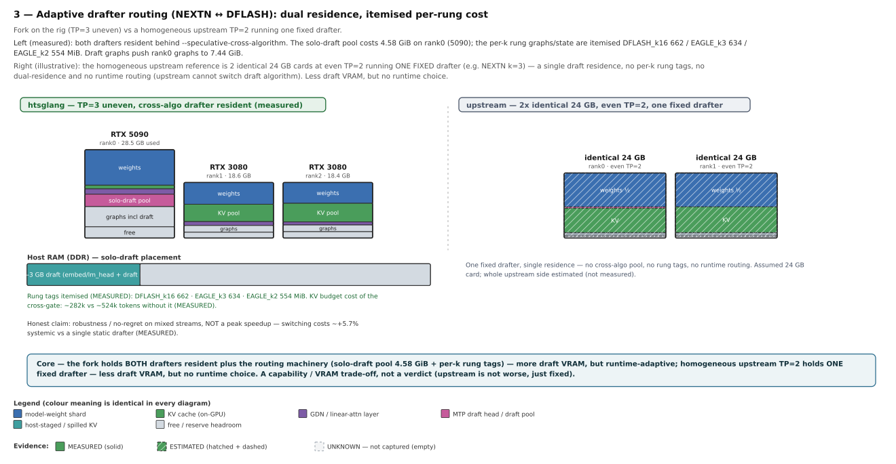

Both draft algorithms are kept resident behind the **cross-algorithm** router
(`--speculative-cross-algorithm`). Measured on the rig
(TP=3 asymmetric): the **solo-draft pool costs 4.58 GiB on rank0**, the per-k rungs are itemised
**DFLASH_k16 662 / EAGLE_k3 634 / EAGLE_k2 554 MiB**, and draft graphs push rank0's graph pool to
7.44 GiB; the KV budget cost of the cross-gate is ~282k vs ~524k tokens without it. The homogeneous
upstream reference is **2 identical 24 GB cards at symmetric TP=2** running **one fixed drafter** (e.g.
NEXTN k=3) — a single draft residence, **no per-k rung tags, no dual-residence and no runtime routing**
(upstream cannot switch draft *algorithm*). That side holds **less draft VRAM** but has **no runtime
choice**. The honest read is a **capability / VRAM trade-off, not a verdict** — the fork spends more
draft VRAM to be runtime-adaptive (robustness / no-regret on mixed streams, not a peak speedup;
switching costs ~+5.7% systemic), upstream spends less and stays fixed. The routing *mechanism* is
diagram 11.

## 4 — Session KV spill (request-level KV offload): keep the newest in-flight request decoding on host RAM

> **Terminology.** The flag and code call this *session* KV offload (`--enable-kv-session-offload`), and
> that name is kept as the feature's label. But the unit here is **not** a multi-turn conversation
> (persistent context across requests, as in LMCache/Mooncake "session KV offload") — it is a **single
> in-flight sglang request** (one running sequence). Read "session" below as **"in-flight request"**.

The differentiator is **request-level KV swapping under memory pressure**: when device KV overflows, the
**newest in-flight request's** full-attention KV shard is moved to host RAM and that request **keeps
decoding on the host** (block-LSE attention, eager `bs=1` tick) — in the spirit of preemption-by-swapping
(KV swapped to host), but the spilled request **keeps decoding rather than pausing**. Victims are ordered
**FCFS by arrival** — the **oldest** running request stays fully device-resident, the **newest** is the
one spilled. **Only KV spills; GDN/Mamba state always stays resident.** S1 is measured: **zero-overhead
when unused +0.16%**, host decode **8.1 tok/s @1k ctx**, restore **~0.4 s**, determinism **50/50 exact**
host-vs-device. The host KV bytes (32 KiB/token × spilled tokens) are estimated from the measured cell
size, and the long-context throughput curve (32k ≈63 … 262k ≈7.6 tok/s) is **modeled, not benchmarked**
(needs S2), worthwhile only with asymmetric DCP active. Upstream has no per-request host-**decode** path:
under KV pressure it swaps/recomputes or **pauses** the request — the device KV pool is a hard ceiling.

The more important number is not the spilled request's rate but **how the device-resident (non-spilled)
request runs during a spill**. Measured isolation matrix (ctx ~1.6k): pre-spill both requests run
**~40 tok/s**; during a spill the **device-resident** request holds **10.4 / 13.4 / 19.9 / 26.0 tok/s at
tick-interval 1 / 2 / 4 / 8**, while the **spilled** request stays **~7–8 tok/s** across all ticks.
Honestly, the device request is still **dragged along** by the spill: the isolation target (the device
loses at most its 1/N tick share) is met only **from tick-interval 4 upward** and is **violated at tick
1 / 2**, where the device drops from ~40 to ~10–13 tok/s — because the spill step **still runs eager and
blocks the shared scheduler tick**. This is the open item; the planned **bs=1 spill CUDA-graph (Step 5,
not yet built, not measured)** should take the eager spill tick out of the shared cadence, after which
even tick-interval 1 should barely touch the device-resident request. The *mechanism* and the full
isolation matrix are in diagram 12.

## 5 — Multi-rank co-location: TP beyond the GPU count — and the KV-head count

**Scalability, shown as a feasibility proof.** TP as a degree is standard sglang; what the fork adds is
lifting the ceilings on it. **TP can exceed the physical GPU count** — several ranks can share one GPU
via **MPS** (plus **NCCL ≥ 2.30** for the co-located communicator). It is not limited to 3 cards; **5
identical cards would work too.** We tested it the original way — **5-rank MPS co-location on 3 cards**
(`--tp 5 --rank-gpu-id 0,0,0,1,2`, MPS, NCCL 2.30.7 side-loaded; three ranks time-slice the 5090 at
~7 GB budget each, one rank per 3080 at ~17 GB) — as a **feasibility proof, not a 5-card performance
number**: decode tok/s is deliberately **not** 5-card-representative (three ranks share one card). The
run is coherent, retrieves a needle from ~15k ctx, and is **bit-identical across two boots**
(`docs/advanced_features/multi_rank_emulation.md`). The budgets are measured; the per-rank weight/KV
split inside each budget was not dumped (*not captured*).

**The deeper enabler.** Models with **few KV heads** can now run on configs with **far more GPUs than
they have KV heads**. The **replicated-KV geometry (Task #62)** — each rank projects all KV heads
replicated and holds one Q-head slice — removes `num_kv_heads` as the ceiling on the rank/GPU count
(e.g. an A3B with **kv=2 at tp=5**). **Asymmetric DCP** is a bonus on top (a KV token-split across the
ranks), and the **kv-boundary-aware auto-split (#116)** keeps a co-located *asymmetric* TP=5 bootable when
`num_kv_heads < tp` (it constrains the per-rank Q-head split to whole KV-head groups, fixing the #105
straddle). Neutral framing: TP itself is upstream; the fork lets you run it beyond the GPU-count and
KV-head-count limits of the cards you have. The upstream side (standard TP=5 = 5 identical cards, one
rank each) is the honest contrast.

The co-location run uses GGUF models (dense-27B-GGUF and 35B-A3B-GGUF). The **GGUF quantisation
itself — the format plus the K-quant / MMQ / MMVQ kernels — comes from ggml/llama.cpp (via
vLLM/upstream)**; the fork's delta is only the **asymmetric-TP adaptation** (256-superblock alignment,
MLP coarsening, the MMQ out-of-bounds fix under expert sharding, and Qwen3.5/3.6 + Gemma-4 arch
adapters) plus the MMVQ↔MMQ crossover tuning. The GGUF quant path is not a fork invention.

## 6 — Weightless-KV lane: free the workers of weights so their VRAM becomes device KV (experimental / WIP)

**Status: experimental / work in progress.** The lane is implemented and its capacity result is measured
(262k proven), but it is not a finished production mode — the deep-context throughput path is still being
worked (graph + prefetch landed; see the rig footnote below), so treat the numbers here as a bring-up
state, not a shipped guarantee.

This is a **capacity** feature, not a "fast" one. The `fastlane` in the flag name
(`--weightless-kv-fastlane`) is historical and does **not** mean the lane is fast; it is also **not
related** to the separate **fast-lane priority scheduling** feature (`--enable-fast-lane`, §9/§13) — the
two are independent. To avoid the collision, this feature is referred to throughout as the
**weightless-KV lane** (its weight-bearing side is the *head lane*).

**The core mechanism (primary).** On the rig (measured), **rank0 (5090) is the HEAD** holding **all**
layer weights as collective-free TP=1, and it is the **only** rank that projects K,V. **rank1/2 (3080)
are weightless meta-device workers** carrying **zero layer weights** (**~14 GiB freed each, measured**).
That freed VRAM holds the **resident, token-sharded device-KV cache** — spanning **all KV heads but only
this rank's token slice** (DCP splits the **token** axis, not the head axis; the KV heads are **not**
replicated on this lane). Per step, **Q (all heads) and the new token's K,V are projected on the head
and broadcast** to the workers (transient, not resident); each worker runs **partial flash-attention**
over its KV-token-shard, then an **LSE-merge** stitches the workers together. So **neither Q-heads nor
projection weights are resident on the workers — only the KV cache bytes; Q is a passed-through
activation.** The capacity win is the **pooled device KV across the freed workers** (head 22.8 / worker
3.7 GiB VRAM in the 262k run, measured).

**The host tier (secondary, extreme context only).** An **optional** host-KV tier sits **on top**, used
only for context that **exceeds the pooled device KV** — up to **262k tokens proven** (~12.6 GiB pinned
host, measured, #134 B1/B2, needle-at-midpoint retrieved). It is an **extension, not the primary
store**: the 262k extreme config deliberately shrinks the device pool and pushes most KV to host (the
40000-device / 64000-host slot split is that extreme config, and the host tier stages only ~C/dcp_size
per rank), whereas **in the normal case the freed worker VRAM holds the device KV**. No unverified
context multiplier is claimed.

Throughput is **interconnect-bound, not a win**: ~25 tok/s @8k · ~7 @28k · ~1.5 @262k eager
(graph+prefetch reaches exact-rung ~26–29). The deep-context floor is **block-attention compute +
per-layer collectives on the slow workers, not H2D bandwidth**. Upstream symmetric-TP holds the layer weights
on **every** rank, so each identical card splits its VRAM between weights and KV and reaches less context
per card without more/bigger equal cards.

> **Rig footnote — an interconnect property, not a feature deficit (and no reflection on upstream).**
> Explicitly hiding the PCIe transfer wall (H2D prefetch / overlap, #136b) gained only **~+14–15% at
> depth on this rig — practically nothing measurable**. The reason is the rig's interconnect, not the
> technique: this box has **no GPUDirect P2P** (a chipset limitation), **no NVLink**, **all links are
> PHB**, and **GPU0 sits on a PCIe x4 lane**, so the worker-side collective latency that forms the deep
> floor cannot be cut here. On a rig **with P2P / NVLink** this latency-hiding could improve. The same
> caveat applies to the other offload / spill / staging-heavy paths (§4 session spill, §7 MoE offload,
> §10 PD).

## 7 — MoE expert offload: a 122B on 3 mismatched cards

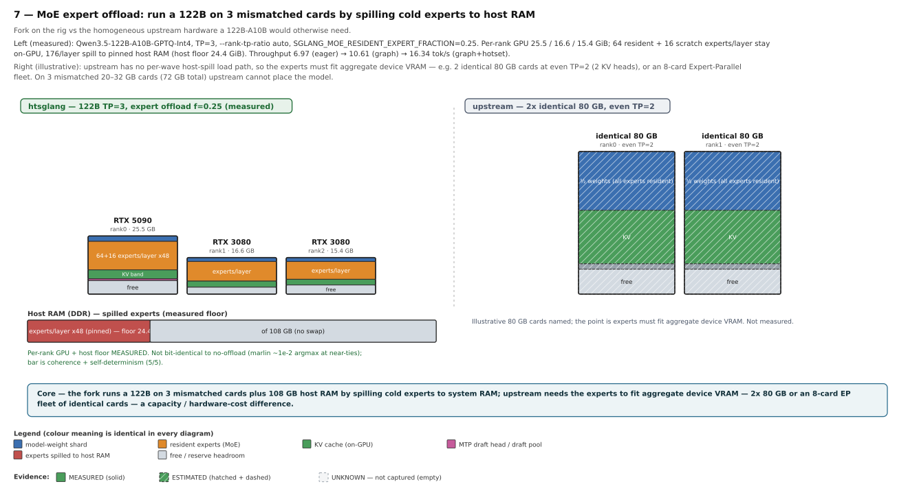

`Qwen3.5-122B-A10B-GPTQ-Int4` runs TP=3 with `SGLANG_MOE_RESIDENT_EXPERT_FRACTION=0.25`: **64 resident
+ 16 scratch** experts/layer stay on-GPU, **176/layer spill to pinned host RAM** (host floor 24.4 GiB,
measured), and per-rank GPU is **25.5 / 16.6 / 15.4 GiB** (measured). Throughput improves from 6.97
(eager) → 10.61 (graph) → 16.34 tok/s (graph + hotset); the offload path is **not bit-identical** to
no-offload (marlin ~1e-2 argmax at near-ties), the bar being coherence + self-determinism.

Upstream also runs the same 122B on a realistic homogeneous config: **2 identical RTX 3090 (24 GB each,
symmetric TP=2) plus `--cpu-offload-gb`** ("How many GBs of RAM to reserve for CPU offloading",
`server_args.py`), keeping part of the weights on-device and the rest in system RAM. The whole right
panel is estimated (stock cpu-offload was not benched here). The mechanism difference, stated neutrally:
`--cpu-offload-gb` is a **generic per-layer-weight offload** — it streams the offloaded weights back in
**every forward**, regardless of which experts a token routes; the fork offload is **expert-granular** —
per token-wave it fetches only the routed top-K experts from host. At the same VRAM budget the fork
moves less data per token, while upstream moves the full offloaded fraction per forward. That is a
capability / data-volume difference, not a "faster" claim. The 122B is a bring-up/validation run of a
feature that is still in progress.

## 8 — Measured VRAM budget: an absolute per-rank MiB budget

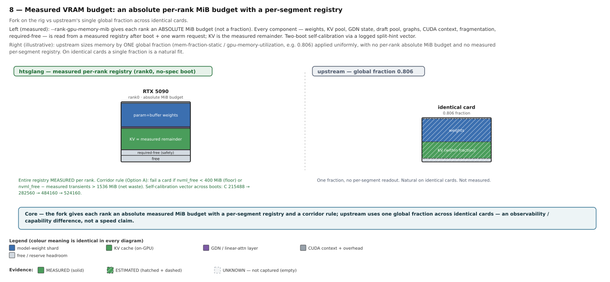

`--rank-gpu-memory-mib` gives each rank an **absolute MiB budget** (not a fraction). Every component —
weights, KV pool, GDN state, draft pool, graphs, CUDA context, fragmentation, required-free — is read
from a **measured registry** after boot + one warm request, and the **KV cache is the measured
remainder**; a logged split-hint vector self-calibrates the split over two boots (C 215488 → 282560 →
484160 → 524160). A **corridor rule** (Option A) fails a card whose `nvml_free < 400 MiB` or whose
`nvml_free − measured transients > 1536 MiB`. Upstream sizes memory by **one global fraction**
(`mem-fraction-static` / `gpu-memory-utilization`, e.g. 0.806) applied uniformly — natural on
identical cards, but with no per-rank absolute budget and no per-segment registry. The registry
*mechanism* is diagram 14.

## 9 — Fast-lane: a fairness / anti-starvation layer on the priority path

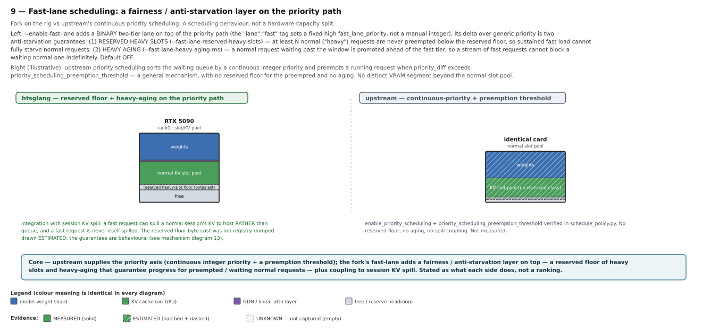

Upstream supplies the **priority axis**: priority scheduling sorts the waiting queue by a **continuous
integer `priority`** and preempts a running request when `priority_diff` exceeds
`priority_scheduling_preemption_threshold` (verified in `schedule_policy.py`) — a general mechanism, with
**no reserved floor for the preempted and no aging**. `--enable-fast-lane` adds a **binary two-tier lane
on that path** (the `"lane":"fast"` tag sets a fixed high `fast_lane_priority`, not a manual integer),
and its delta is precisely **two anti-starvation guarantees** generic priority does not have:

1. **Reserved heavy slots** (`--fast-lane-reserved-heavy-slots`): at least N normal ("heavy") requests are
   never preempted below the reserved floor (`max_heavy_preemptible = num_heavy_running − reserved_slots`;
   preemption stops at the floor) — so sustained fast load **cannot fully starve** normal requests.
2. **Heavy aging** (`--fast-lane-heavy-aging-ms`): a normal request waiting past the window is promoted to
   `fast_lane_priority − 1` and jumps **ahead of** the fast tier — so a stream of fast requests **cannot
   block** a waiting normal one indefinitely.

It also couples with session KV spill (a fast request can spill a normal in-flight request's KV to host
rather than queue; a fast request is never itself spilled). This is a **scheduling-behaviour** difference, **default
off** (default path byte-unchanged); the reserved-floor byte cost was not registry-dumped (drawn
estimated). The *mechanism* is diagram 13.

## 10 — PD-disaggregation: keep prefill off the slow lane (experimental / WIP)

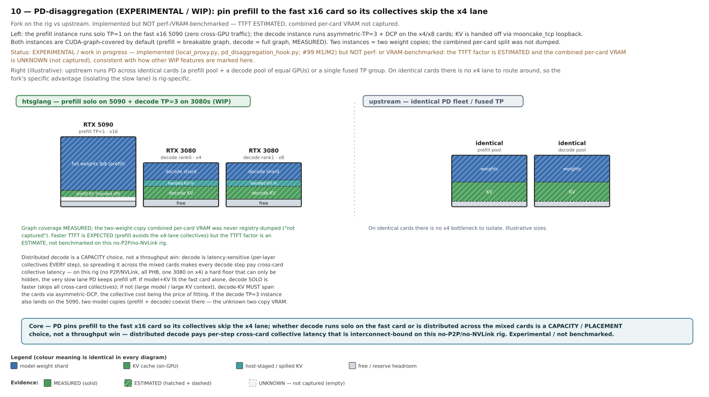

**Status: experimental / work in progress.** The path is implemented (`local_proxy.py`,
`pd_disaggregation_hook.py`; #99 M1/M2) but **not perf- or VRAM-benchmarked** — the TTFT factor is
**estimated** and the combined per-card VRAM is **unknown (not captured)**, marked the same way as the
other WIP features here.

The prefill instance runs **solo TP=1 on the fast x16 5090** (zero cross-GPU traffic); the decode
instance runs **asymmetric-TP=3 + DCP on the x4/x8 cards**; KV is handed off via `mooncake_tcp` loopback.
**Both instances are CUDA-graph-covered by default** (prefill = breakable graph, decode = full graph,
measured). Faster TTFT is **expected** because prefill avoids the ×4-lane collectives, but the TTFT
factor is an **estimate, not benchmarked** on this no-P2P/no-NVLink rig.

**Distributing decode across all cards is a capacity choice, not a throughput win.** Decode is
latency-sensitive — it runs per-layer collectives on **every** step — so spreading it across the mixed
cards makes each decode step pay **cross-card collective latency**, which on this rig (no P2P/NVLink,
all PHB, one 3080 on ×4) is a hard floor that can only be *hidden*, never removed — the very slow lane
PD keeps prefill off. Concretely:

- **Model + KV fit the fast card alone** → running **decode solo** is faster, because it skips all
  cross-card collectives.
- **They do not fit** (large model / large KV context) → decode-KV **must** span the cards via
  asymmetric-DCP, and the collective cost is simply the price of fitting.

If the decode TP=3 instance also lands on the 5090, **two model copies (prefill + decode) coexist**
there — the unknown two-copy VRAM above. Upstream runs PD across identical cards or a single fused TP
group; on identical cards there is no ×4 lane to route around, so the fork's advantage here is
rig-specific. No throughput numbers are quoted — none were benchmarked.

---

# Appendix — how the capabilities compose (illustrative, not measured)

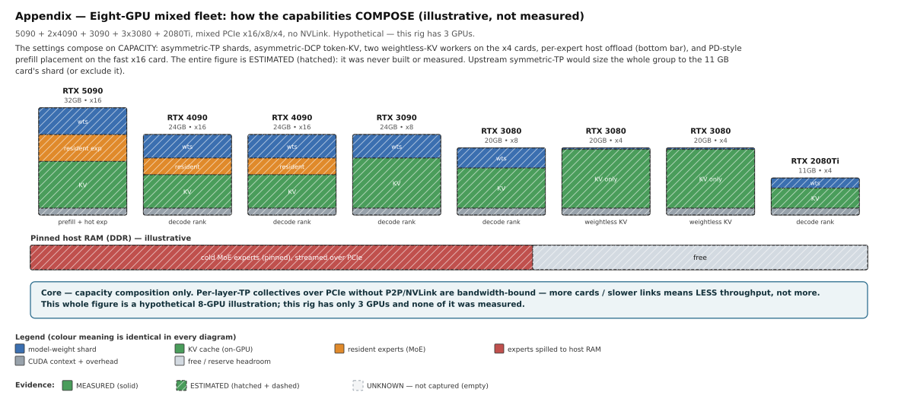

This figure is a **hypothetical illustration** of how the settings **compose on capacity** across a
larger mixed fleet — it was **never built or measured** (this rig has 3 GPUs), so the whole diagram is
drawn hatched/estimated. Hard caveat: **per-layer-TP collectives over PCIe without P2P/NVLink are
bandwidth-bound — more cards / slower links means *less* throughput, not more**. It shows composition
of capacity only, never a throughput claim.

---

# Runtime-mechanism diagrams

The diagrams above show *where memory goes*. These four explain the *mechanism* of a feature —
how the draft algorithm is routed, how KV overflow is handled, how the scheduler prioritises, and how
the VRAM budget is measured. Colour meaning is unchanged.

## 11 — Adaptive drafter routing (mechanism)

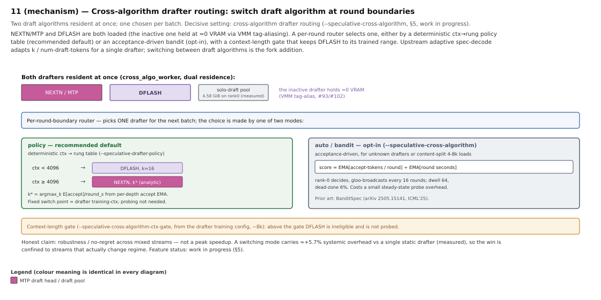

Both algorithms are loaded (the inactive one held at ≈0 VRAM via VMM tag-aliasing). A per-round router
selects one, either by a deterministic **ctx → rung policy table** (recommended default) or an
acceptance-driven **bandit** (opt-in), with a context-length gate keeping DFLASH to its trained range.
Upstream adaptive spec-decode adapts `k` for a single drafter; switching between draft *algorithms* is
the fork addition. Work in progress (§5).

## 12 — Session KV spill / request-level KV offload (mechanism)

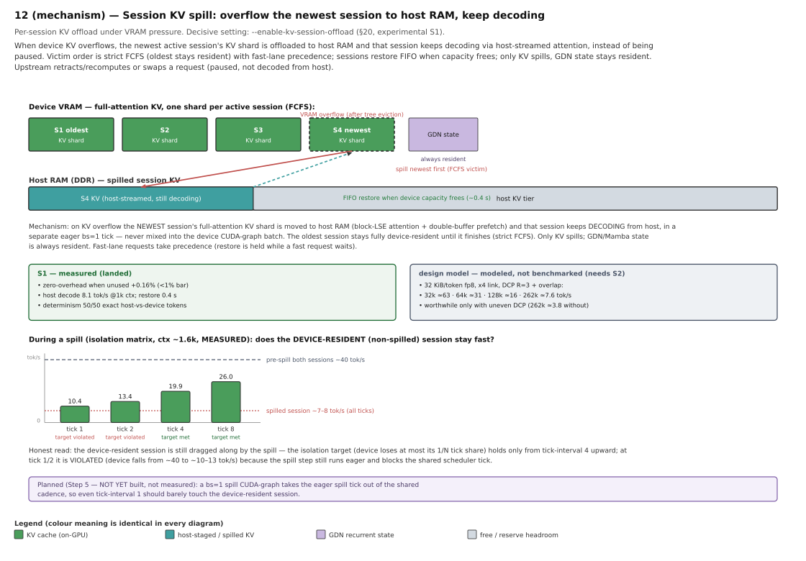

The unit is a **single in-flight request** (one running sequence), not a multi-turn conversation — the
flag name `session` is kept as the feature's label only. On device KV overflow the **newest in-flight
request's** KV shard moves to host RAM and keeps decoding from host in a separate eager `bs=1` tick, never
mixed into the device CUDA-graph batch. Victim order is strict **FCFS by arrival** (the oldest running
request stays fully resident) with fast-lane precedence; requests restore FIFO; only KV spills, GDN state
stays resident. Experimental S1 measured; the long-context curve is modeled (needs S2). Upstream
swaps/recomputes or **pauses** a request under KV pressure (`--enable-kv-session-offload`, §20).

The diagram's **isolation matrix** (measured, ctx ~1.6k) records how the **device-resident** request
runs during a spill: **10.4 / 13.4 / 19.9 / 26.0 tok/s at tick-interval 1 / 2 / 4 / 8** (pre-spill
~40), spilled request ~7–8 tok/s. The isolation target holds only from tick-interval 4 up and is
**violated at tick 1 / 2** because the spill step still runs eager on the shared tick — the open item
the planned **bs=1 spill-graph (Step 5, not yet built, not measured)** is meant to resolve.

## 13 — Fast-lane: fairness / anti-starvation layer (mechanism)

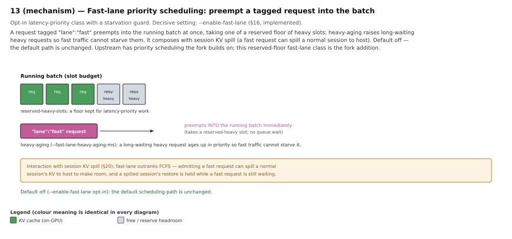

Upstream supplies the priority axis (continuous integer `priority` + preemption when `priority_diff` >
`priority_scheduling_preemption_threshold`, verified in `schedule_policy.py`) — general, with no reserved
floor and no aging. The fork's fast-lane is a **binary opt-in lane on that path** whose delta is two
anti-starvation guarantees: **reserved heavy slots** (`max_heavy_preemptible = num_heavy_running −
reserved_slots`; preemption stops at the floor, so fast load cannot fully starve normal requests) and
**heavy aging** (a normal request waiting past the window is promoted to `fast_lane_priority − 1` and
jumps ahead of the fast tier). It couples with session KV spill (a fast request can spill a normal
in-flight request to host rather than queue; a fast request is never itself spilled). Default off — the default
path is unchanged (`--enable-fast-lane`, §16). Stated as what each side does, not a ranking.

## 14 — Measured VRAM budget (mechanism)

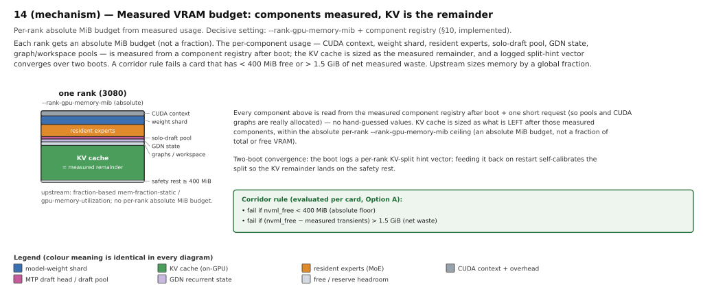

Each rank gets an absolute MiB budget; every component is measured from a registry after boot + one
short request, and the **KV cache is the measured remainder**. A logged split-hint vector converges
over two boots; a corridor rule fails a card with < 400 MiB free or > 1.5 GiB net measured waste.
Upstream sizes memory by a global fraction (`--rank-gpu-memory-mib` + component registry, §10).

---

## Caveats

- **Diagrams are schematic.** VRAM box heights are to scale; segment sizes are measured where the
  evidence key marks them solid, estimated where hatched, and *not captured* where empty.
- **The entire upstream (right) panel of every side-by-side is ESTIMATED** — a hypothetical config on
  identical cards that was never built here. The assumed card size is named each time.
- **The honest difference is capacity / hardware premise, not raw speed.** Where throughput appears
  it is stated plainly with the interconnect caveat: this rig has **no P2P and no NVLink**, so every
  cross-GPU collective is PCIe-bandwidth-bound, and a better interconnect changes the cost side of
  every cross-GPU feature.
- **Contaminated throughput figures** (pre-2026-07-22 SSE bench) are withdrawn, not shown as fact.
- **In-progress / experimental features** are labelled as such: the 122B expert-offload run is a
  bring-up/validation run (in progress), adaptive drafter routing is work in progress, session KV
  spill is experimental (S1), the weightless-KV lane is experimental/WIP (capacity measured, throughput
  path still in progress), and PD-disaggregation is experimental/WIP (implemented but not
  perf-/VRAM-benchmarked).
- **GGUF attribution:** where GGUF appears (co-location, §5), the quantisation format and its
  K-quant / MMQ / MMVQ kernels come from ggml/llama.cpp via upstream; the fork's contribution is the
  asymmetric-TP adaptation and crossover tuning, not the quant path itself.
- The SVGs are regenerated by [`topologies/gen.py`](topologies/gen.py) (`python3 topologies/gen.py`);
  they are self-contained (inline shapes + text only, no external fonts or images).
