# htsglang — GPU Topologies and the Setting That Wins Each One

Companion to [FEATURES_VS_UPSTREAM.md](FEATURES_VS_UPSTREAM.md). That document is the
capability inventory; this one is the *placement* guide. It has two parts:

1. **The hero config (granular):** the measured **122B-A10B-Int4 on TP=3** end-state on the
   reference rig (1× RTX 5090 32 GB + 2× RTX 3080 20 GB, PCIe, no NVLink), drawn down to
   individual decoder layers, KV heads, per-token KV bands, the MoE expert-offload flow, and
   where MTP and the CUDA-graph boundary sit — each paired side-by-side with what **stock
   sglang** does on the same three cards.
2. **The capability atlas (general):** the same ideas across a range of 2-8 GPU
   constellations of mixed VRAM / compute / interconnect.

Every capability is grounded in FEATURES_VS_UPSTREAM.md (section numbers in parentheses); the
concrete 122B numbers are the measured end-state run of the per-expert offload path (which is
still §6 **[in progress]**). Anything not yet shipped is labelled **[in progress]** or
**[planned]** exactly as in the parent doc. Impact/throughput figures are the parent doc's
rounded, directional numbers on this PCIe rig — not benchmarks.

## How to read the diagrams

GPU boxes are drawn with **height scaled to VRAM**; a separate horizontal bar is **pinned
host RAM (DDR)**. Interconnect lines: solid = PCIe x16, thin dashed brown = PCIe x4; this rig
has **no NVLink**, so collectives run over PCIe host-staging. Colour meaning is consistent
across every diagram:

- blue — model-weight shard (Q-heads, FFN, dense weights)
- green — KV cache / KV heads (on-GPU)
- amber — resident MoE experts (kept on the GPU)
- light amber — expert scratch / prefetch staging slots
- red — MoE experts spilled to pinned host RAM
- teal — host-staged / transferred KV (PD handoff)
- grey-blue — free / reserve headroom; grey — CUDA context + overhead
- steel — full-attention layer (holds KV); violet — GDN / linear-attention layer (holds state)
- light violet — GDN recurrent state; pink — MTP / NEXTN draft head
- pale red-grey — a **stock** region that is impossible or wasted on this hardware

Region sizes inside a card are illustrative partitionings, **except** where a figure is quoted
from the measured run or the parent doc (per-rank GB, expert counts, tok/s). Every "our-mode"
diagram is paired with its **stock sglang** counterpart, drawn as a real layout — not a bare
"can't".

---

# Part 1 — The hero: 122B-A10B-Int4 on TP=3 (measured end-state)

Model: `Qwen3.5-122B-A10B-GPTQ-Int4` — 48 decoder layers, hybrid-GDN (~3:1), 256 experts per
layer, top-8 routing, ~10B active, **2 GQA KV heads**, 32 Q heads, FFN intermediate 1024, GPTQ
`group_size` 128. Launch (measured): `--tp-size 3 --dcp-size 3 --rank-tp-ratio auto
--rank-gpu-id 0,1,2 --rank-gpu-memory-mib 28000,19000,19000 --dtype float16 --attention-backend
flashinfer --disable-cuda-graph`, `SGLANG_MOE_RESIDENT_EXPERT_FRACTION=0.25`. `--rank-tp-ratio
auto` resolved to **[28,19,19]**. Measured: per-rank GPU **25.5 / 16.6 / 15.4 GB**, host floor
**24.4 GB**, **6.97 tok/s**, coherent, self-det 5/5.

> Correctness bar for this GPTQ-Int4 (marlin) path is **coherence + self-determinism +
> divergence only at near-ties** — a ~1e-2 argmax delta is intrinsic to marlin-Int4 tiling and
> is not a regression (the FP8 path in §6 is separately byte-identical; the Int4/marlin path is
> not, by design). No bit-identity is claimed here.

## 1.1 The model both stacks run

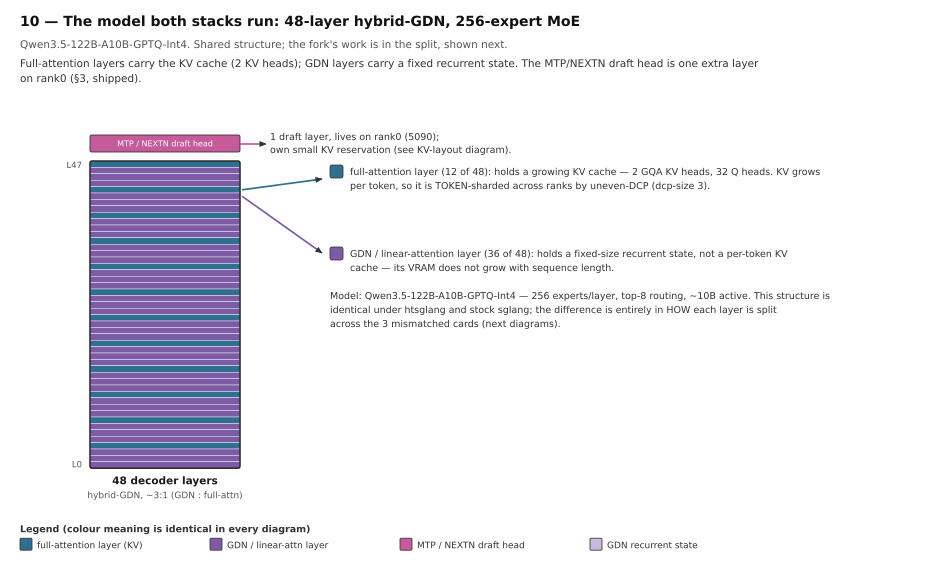

The 48 layers alternate **GDN / linear-attention** (36 layers, a fixed recurrent state, no
per-token KV growth) with **full-attention** layers (12 layers, ~1 in 4, carrying the KV
cache). The **MTP / NEXTN** draft head (§3, shipped) is one extra layer on rank0. This
structure is identical under htsglang and stock sglang — the entire difference is in **how each
layer is split** across three mismatched cards, which is what the rest of Part 1 shows.

## 1.2 One layer's tensors across 3 cards — uneven-TP vs even-TP

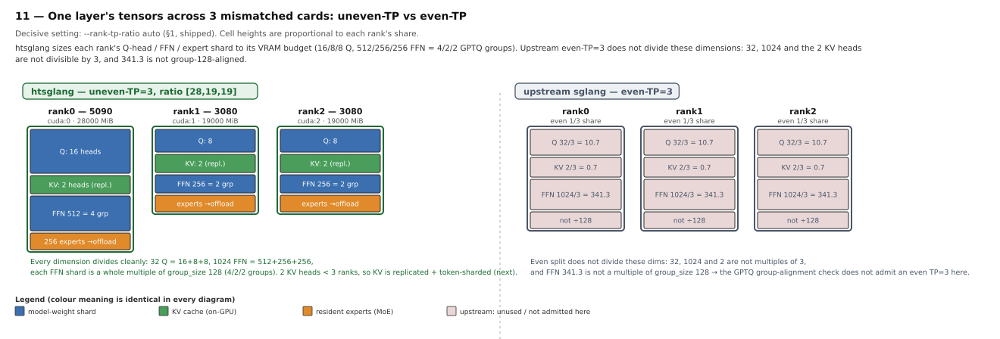

**htsglang** (`--rank-tp-ratio auto` → [28,19,19], §1 shipped) sizes each rank's shard to its
VRAM budget: **Q heads 16/8/8** (of 32), **FFN intermediate 512/256/256** (of 1024) — a whole
multiple of `group_size` 128 on every rank, i.e. **4/2/2 GPTQ groups**. The **2 KV heads** are
below the rank count, so they are replicated (next diagram).

**Stock sglang** can only split evenly, and even-TP=3 does not divide: 32 Q, 1024 FFN and 2 KV
heads are not multiples of 3, and 1024/3 = 341.3 is not `group_size`-128-aligned → the GPTQ
group-alignment assert fires and the server refuses to launch. On these exact dimensions, an
even TP=3 is impossible before any memory question is even reached.

## 1.3 2 KV heads across 3 ranks — the DCP token-shard (the crux)

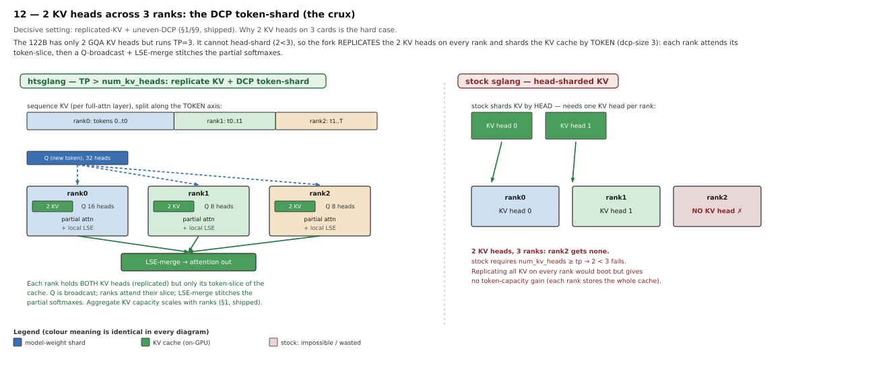

This is the decisive idea. With only **2 GQA KV heads** but **TP=3**, the KV cache cannot be
head-sharded (2 < 3). htsglang instead **replicates the 2 KV heads on every rank** and shards
the KV cache along the **token axis** (`--dcp-size 3`, uneven-DCP, §1 shipped): each rank owns a
token band of the sequence's KV, the new token's **Q is broadcast** to all ranks, each rank
computes a **partial attention + local LSE** over its band, and an **LSE-merge** collective
stitches the partial softmaxes into the final output. What is duplicated is only the small
2-KV-head slice; the KV *tokens*, and the query heads, are still split — so aggregate KV
capacity scales with the rank count.

**Stock sglang** shards KV by head and therefore needs `num_kv_heads ≥ tp`: with 2 heads and 3
ranks, rank2 gets no KV head and the launch fails. Replicating all KV on every rank would boot
but stores the whole cache on each card — no token-capacity gain, and the even-TP dimensions
still fail (1.2).

## 1.4 KV-cache arrangement across ranks, and where MTP sits

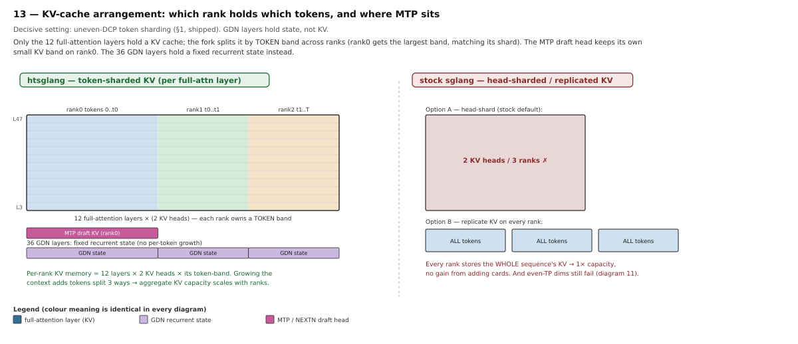

Only the **12 full-attention layers** hold a KV cache; the fork lays it out as **token bands**
per rank (rank0 gets the largest band, matching its shard). The **MTP draft head keeps its own
small KV band on rank0**. The **36 GDN layers** hold a fixed recurrent state instead (a small
per-rank block, independent of sequence length). Per-rank KV memory is `12 layers × 2 KV heads
× that rank's token band`, so growing the context adds tokens split three ways — aggregate KV
capacity scales with ranks (§1).

**Stock sglang** either head-shards (impossible, 2 < 3) or replicates the whole KV on every
rank (1× capacity, no gain from adding cards).

## 1.5 Per-layer MoE expert offload — 256 → 64 resident + 16 scratch + 176 host

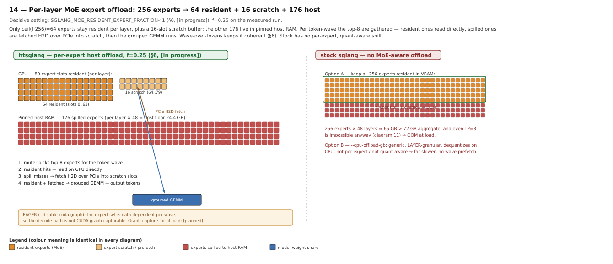

The model's experts do not fit VRAM, so `SGLANG_MOE_RESIDENT_EXPERT_FRACTION=0.25` (§6 **[in
progress]**) keeps only **ceil(0.25·256) = 64** experts resident per layer, plus a **16-slot
scratch** buffer (buffer = 80); the other **176** live in **pinned host RAM** (per layer × 48 →
host floor 24.4 GB). Per token-wave the router's **top-8** experts are gathered: resident ones
read directly, **spilled ones are fetched H2D over PCIe into scratch**, then the grouped GEMM
runs. Waving over tokens (not experts) keeps it coherent (§6).

Because the expert set is **data-dependent per wave**, the decode path is **not
CUDA-graph-capturable** → this run uses **`--disable-cuda-graph` (eager)**, consistent with §6's
"eager-only by design". Graph-capture for the offload path is **[planned]**.

**Stock sglang** has no per-expert, quant-aware spill: keeping all 256 experts resident needs
~65 GB > the 72 GB aggregate (and even-TP=3 is impossible anyway) → OOM at load; the only
generic option, `--cpu-offload-gb`, is layer-granular and dequantizes on CPU (far slower, no
wave prefetch).

## 1.6 The whole rig, measured — vs stock "cannot run"

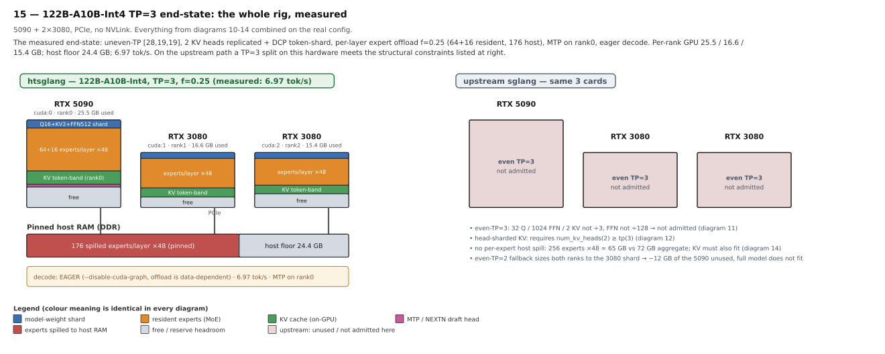

Everything above, on the real config: uneven-TP **[28,19,19]**, 2 KV heads replicated + DCP
token-shard, per-layer expert offload **f=0.25** (64+16 resident, 176 host), MTP on rank0,
**eager** decode. Measured per-rank GPU **25.5 / 16.6 / 15.4 GB**, host floor **24.4 GB**,
**6.97 tok/s** (which beats the solo-card 4.8 tok/s).

**Stock sglang** produces no valid TP=3 configuration on these three cards: even-TP=3 does not
divide (1.2); head-sharded KV needs `num_kv_heads(2) ≥ tp(3)` (1.3); with no MoE offload the
model OOMs the aggregate (1.5); and falling back to even-TP=2 caps both ranks to the 3080 shard,
wasting ~12 GB of the 5090 and still OOMing.

## 1.7 The same machinery at other scales

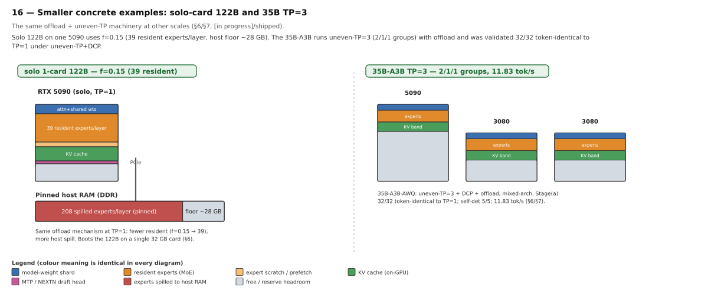

The same offload + uneven-TP path runs at other scales. **Solo 122B on one 5090** uses **f=0.15
(39 resident experts/layer**, host floor ~28 GB) — it boots the 122B on a single 32 GB card
(§6). The **35B-A3B-AWQ** runs uneven-TP=3 (**2/1/1** GPTQ/AWQ groups) with offload across mixed
architectures and was validated stage(a) **32/32 token-identical to TP=1** under uneven-TP+DCP,
self-det 5/5, 11.83 tok/s (§6/§7).

---

# Part 2 — Capability atlas (general topologies)

The same ideas across a range of 2-8 GPU constellations. For each, the canonical hardware where
that setting is the decisive advantage, and what stock sglang is forced to do on it.

## Summary — topology class → winning setting → what stock sglang does instead

| Topology class | Decisive fork setting | Source | What stock sglang is forced to do |
|---|---|---|---|
| 2 mismatched GPUs, PCIe | `--rank-tp-ratio` (proportional shards) | §1 | Even TP only → both ranks capped to the small card; the big card's extra VRAM is wasted |
| 3 mismatched GPUs, more KV wanted | `--rank-tp-ratio auto` + uneven-DCP token KV | §1 | Even TP + head-axis KV; can't fill the big card, ≈2.5-3× less usable context |
| Model with fewer KV heads than ranks | TP > num_kv_heads (replicate KV + token-shard) | §1, §9 | TP capped at `num_kv_heads`; extra cards cannot join the group |
| MoE with more experts than fit VRAM | resident-fraction expert offload **[in progress]** | §6 | Only generic `--cpu-offload-gb` (layer-granular, not quant/MoE-aware, slow) or EP (experts must fit aggregate VRAM) |
| Model too big for any single card | load-time MoE offload to host RAM **[in progress]** | §6 | Cannot run — OOMs at load; EP needs the experts to fit aggregate VRAM |
| Long-context priority | weightless-KV fast lane (Variant C, landed) | §10 | Every rank must hold layer weights; slow cards spend VRAM on weights instead of KV |
| More ranks than physical cards | multi-rank co-location (`--rank-gpu-id` duplicates) | §9 | TP bounded by physical GPU count; can't place two ranks on one card |
| A slow PCIe x4 link in the rig | single-node PD-disaggregation | §2 | One TP group forces prefill collectives over the x4 lane too, throttling TTFT |
| 8-GPU mixed fleet | several of the above combined | §1/§6/§9/§10 | Even TP drops the whole group to the smallest card's shard; none of the token-KV / weightless / offload paths exist |

## 2.1 Two mismatched GPUs, PCIe — uneven Tensor Parallelism

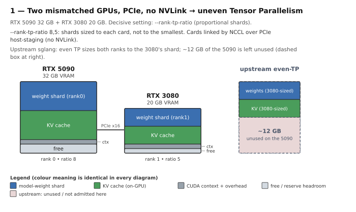

`--rank-tp-ratio` (§1) sizes the TP shards in proportion to each card (8:5), so the 5090 carries
a bigger shard and KV slice than the 3080. Stock even-TP caps both ranks to the 3080's shard,
stranding ~12 GB on the 5090 (the dashed "WASTED" region).

## 2.2 Three mismatched GPUs — uneven-TP auto + uneven-DCP

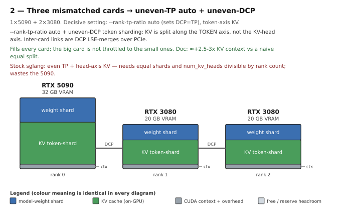

`--rank-tp-ratio auto` fills every card and sets DCP = TP; KV follows the **token axis**, so KV
capacity is decoupled from the weight split (**≈+2.5-3× KV context** vs a naive equal split, §1;
honest cost ≈-10-25% decode from the PCIe collectives). Stock even-TP + head-axis KV needs equal
shards and `num_kv_heads` divisible by the rank count, and cannot fill the 5090.

## 2.3 Fewer KV heads than ranks — TP > num_kv_heads

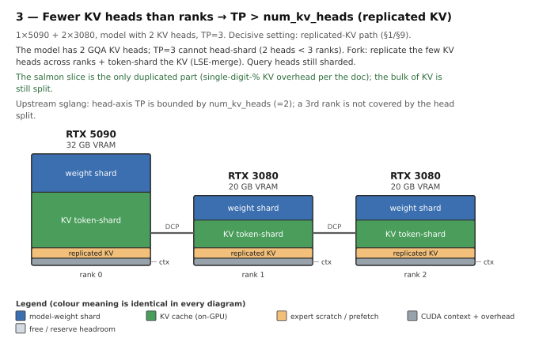

The general form of 1.3: replicate the few KV heads, token-shard + LSE-merge (§1/§9). The
duplicated slice is a single-digit-% KV overhead; stock head-axis TP is capped at `num_kv_heads`
so the extra card cannot join.

## 2.4 MoE bigger than VRAM — per-expert host offload + uneven-TP

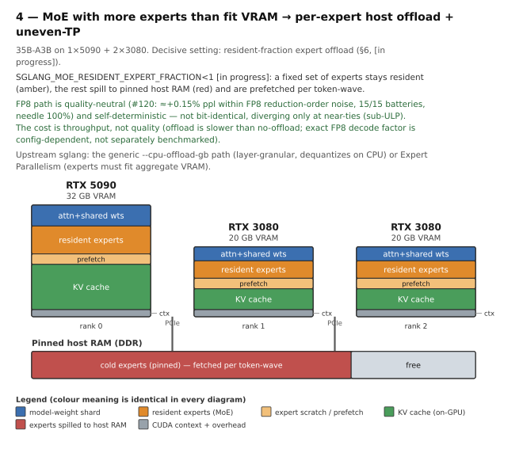

The general form of 1.5: a resident fraction on-GPU, the rest in pinned host RAM, prefetched per
token-wave (§6 **[in progress]**). The FP8 path is byte-identical (#120: ≈+0.15% ppl, 15/15
batteries); the cost is throughput (decode ≈1.4×), not quality. Stock offers only generic
`--cpu-offload-gb` or Expert Parallelism (experts must fit aggregate VRAM).

## 2.5 Model too big for any single card — load-time offload to host RAM

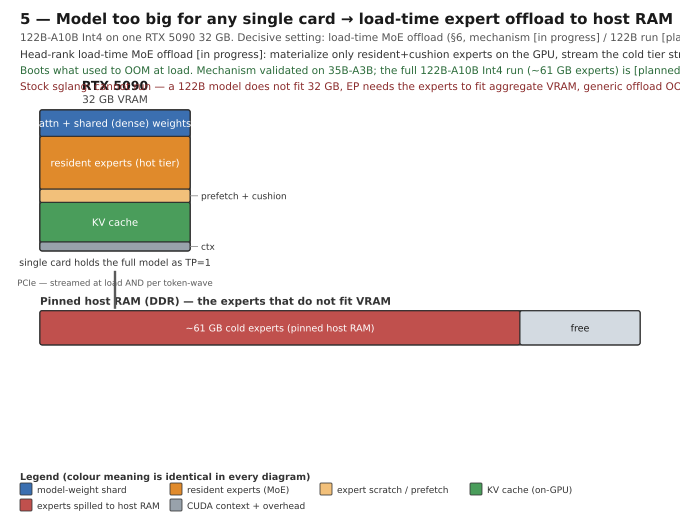

The general form of 1.7 (solo): materialise only resident+cushion experts on the GPU and stream
the cold tier straight to host RAM at load (§6 head-rank load-time offload **[in progress]**) —
boots what used to OOM at load. Stock cannot run a 122B on one 32 GB card at all.

## 2.6 Long-context priority — weightless-KV fast lane

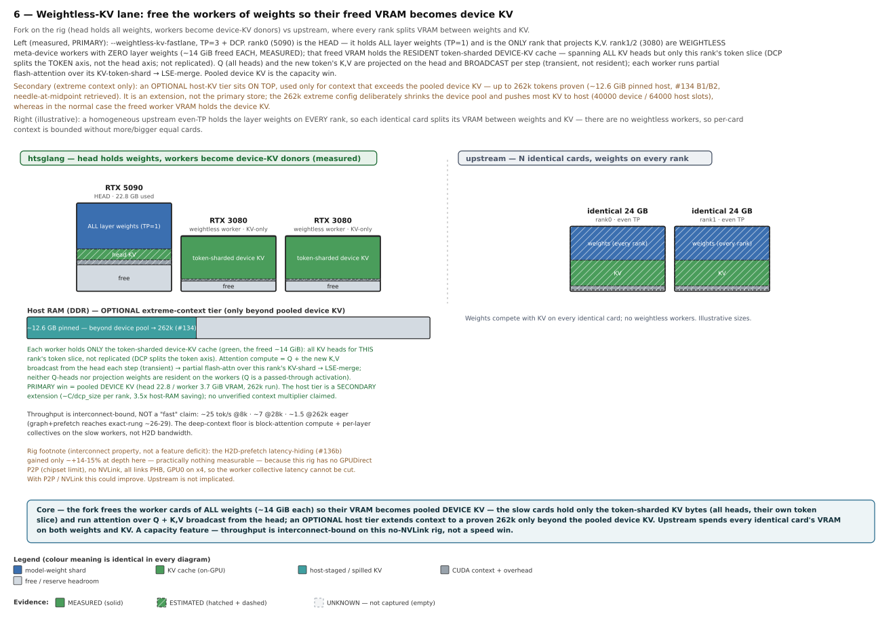

The fast card holds the full model as collective-free TP=1; the slow cards become **weightless
KV workers** holding only a KV token-shard (§10, Variant C B1+B2a, landed, eager-only). ≈14 GB
freed per worker → **≈4× context** on the 27B test model; extend Δ=0 vs full-TP=1. Stock makes
every rank hold layer weights.

## 2.7 More ranks than cards — multi-rank co-location

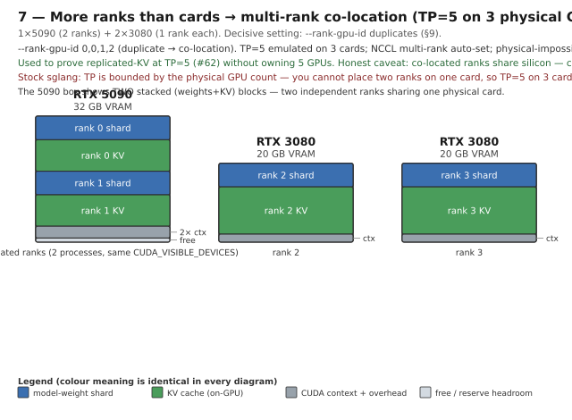

`--rank-gpu-id 0,0,1,2` places two ranks on the 5090 as two processes (§9); NCCL multi-rank is
auto-set and a physical-impossibility check guards it. Used to prove replicated-KV at **TP=5 on
3 GPUs** (#62). Co-located ranks share silicon — capability, not extra bandwidth. Stock bounds
TP at the physical card count.

## 2.8 A slow PCIe x4 link — PD-disaggregation placement

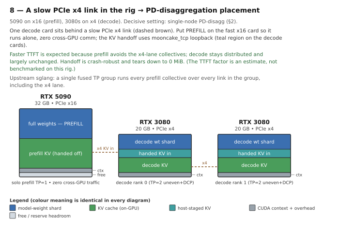

Put prefill solo on the fast x16 card (zero cross-GPU traffic); decode distributed on the x4
cards, KV handed off via `mooncake_tcp` loopback (§2). **≈2-5× faster TTFT**; decode essentially
unchanged. Stock fuses one TP group, forcing prefill collectives over the x4 lane.

## 2.9 Eight-GPU mixed fleet — several capabilities combined

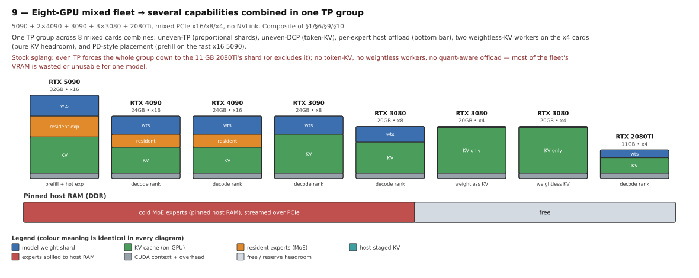

On a fleet spanning 11-32 GB and three PCIe speeds the settings **compose**: uneven-TP shards,
uneven-DCP token-KV, weightless-KV workers on the x4 cards, per-expert offload to host RAM, and
prefill on the fast x16 5090. Stock even-TP drops the whole group to the 11 GB card's shard (or
excludes it) and has none of the token-KV / weightless / offload paths.

---

## Caveats

- Diagrams are schematic. VRAM box heights are to scale; internal region splits are illustrative
  unless a figure is quoted from the measured 122B run or the parent doc.
- The 122B TP=3 numbers (per-rank GB, host floor, 6.97 tok/s, self-det 5/5) are the measured
  end-state run of the per-expert offload path, which is itself §6 **[in progress]**; this is a
  bring-up/validation run of an in-progress feature, not a shipped production mode.
- The GPTQ-Int4/marlin path is **not** bit-identical (~1e-2 argmax delta is intrinsic to marlin
  tiling); the byte-identity claim in §6 is for the FP8 path specifically.
- Impact figures are the parent doc's rounded, directional numbers on the PCIe reference rig (no
  NVLink). A better interconnect changes the cost side of every cross-GPU feature.
- `[in progress]` (expert offload, load-time MoE offload) and `[planned]` (graph-capture for the
  offload path) are labelled as in the parent doc — not shipped.
- The SVGs are regenerated by [`topologies/gen.py`](topologies/gen.py); they are self-contained
  (inline shapes + text only, no external fonts or images).
